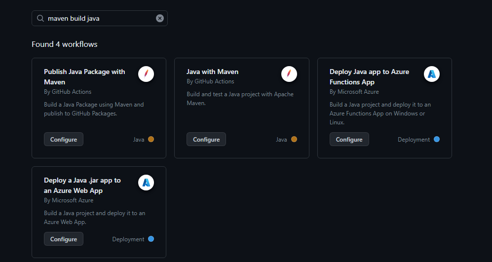
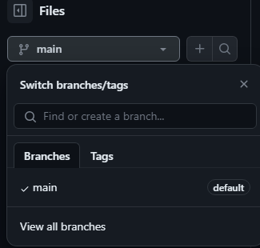
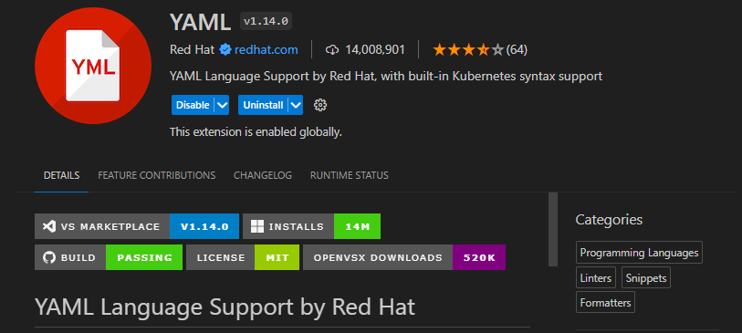
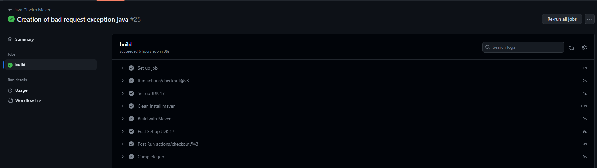
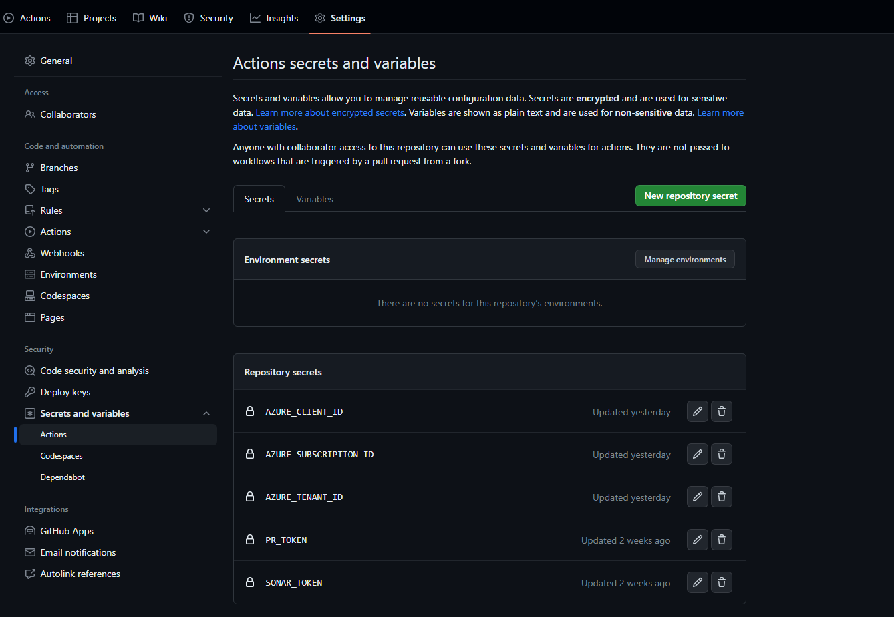
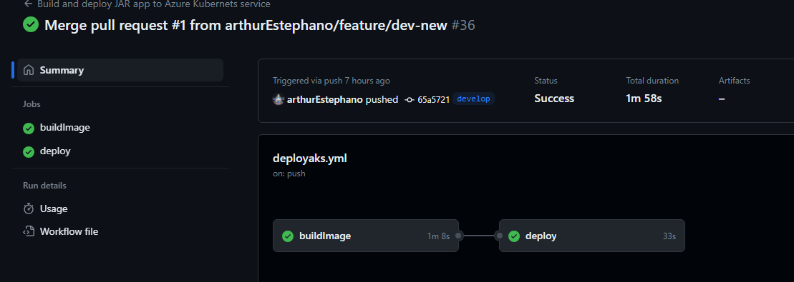
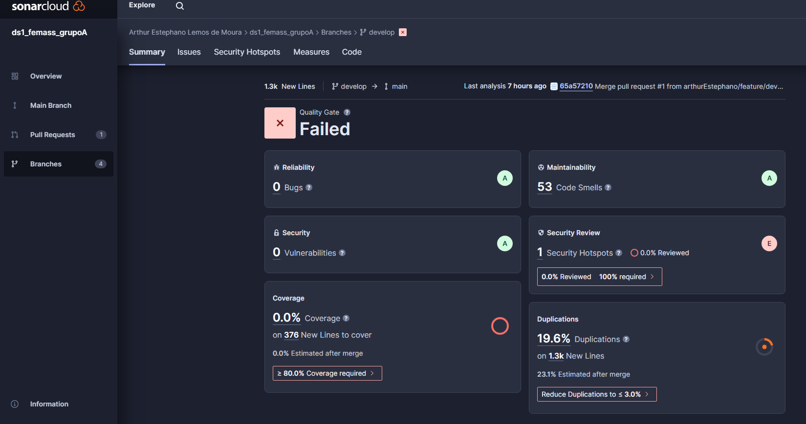
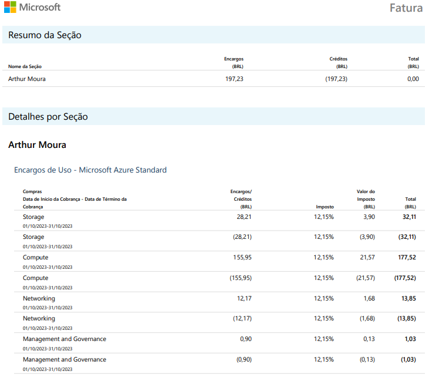
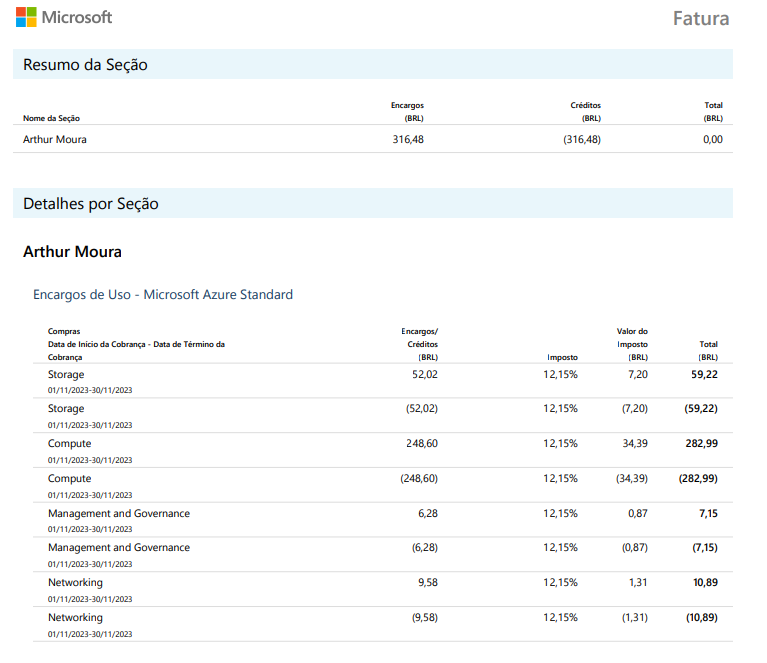

# Guia para implementação e desenvolvimeto de Pipelines DevOps

Este guia assim como este repositório foram criados visando instigar e prover os alunos da FeMASS com as informações mínimas necessárias para criação, desenvolvimento e implementação de pipelines nos seus projetos de desenvolvimento de software.

O entendimento de em que momento do fluxo e quando cada pipeline vai atuar depende também de certo conhecimento perante CI/CD e DevOps, é recomendado ler o pdf relativo ao trabalho de conclusão de curso do dono deste repositório, é recomendado também a leitura do livro do Pereira Neto (2022): DevOps: CI e CD, disponível na loja virtual da amazon para Kindle.

As justificativas para utilização de pipelines está contida no pdf que existe neste repositório que representa o Trabalho de Conclusão de Curso do autor e proprietário deste repositório.

## Sumário de Conteúdos

- [Guia para implementação e desenvolvimeto de Pipelines DevOps](#guia-para-implementação-e-desenvolvimeto-de-pipelines-devops)
  - [Sumário de Conteúdos](#sumário-de-conteúdos)
  - [Sobre as ferramentas](#sobre-as-ferramentas)
  - [Criando uma pipeline no GitHub Actions](#criando-uma-pipeline-no-github-actions)
  - [Conceitos Iniciais](#conceitos-iniciais)
  - [Desenvolvimento de uma pipeline para teste e build de um projeto java](#desenvolvimento-de-uma-pipeline-para-teste-e-build-de-um-projeto-java)
  - [Desenvolvendo uma pipeline para deploy de um projeto java em um cluster AKS](#desenvolvendo-uma-pipeline-para-deploy-de-um-projeto-java-em-um-cluster-aks)
    - [Build](#build)
    - [Deploy](#deploy)
  - [Desenvolvendo uma pipeline para integração com SonarCloud](#desenvolvendo-uma-pipeline-para-integração-com-sonarcloud)
  - [Outros serviços de pipelines](#outros-serviços-de-pipelines)
  - [Custos](#custos)
  - [Criador](#criador)

## Sobre as ferramentas

- A ferramenta utilizada como serviço de pipeline é o GitHub Actions, este é um recurso gratuito do GitHub.
- A ferramenta de análise SonarCloud é uma ferramenta gratuita caso aceite as condições relativas a assinatura gratuita.
- As ferramentas relativas a Azure são gratuitas se criadas com a utilização do [GitHub Education](https://education.github.com/students) a partir de um crédito recebido da Azure.
- É recomendado o uso da extensão SonarLint na IDE selecionada para criação tanto do projeto quanto das pipelines, é possível ver o detalhamento desta no pdf referente ao trabalho de conclusão de curso presente neste repositório.

## Criando uma pipeline no GitHub Actions

Para criar uma pipeline GitHub Actions basta abrir no seu repositório a aba "actions", como na imagem abaixo:


Uma vez dentro dessa opção é possível procurar qual WorkFlow se deseja utilizar, por exemplo build java com maven:



Uma vez o template selecionado e devidamente alterado, é possível adicionar este ao seu projeto utilizando o botão "Commit changes...", porém é necessário atentar-se a branch a qual esta pipeline está sendo commitada, para alterar a branch basta alterar para a desejada como na imagem abaixo:



Antes de continuarmos e configurarmos nossa pipeline devidamente devemos nos atentar aos conceitos básicos de qualquer pipeline.

## Conceitos Iniciais

É necessário entender os parâmetros mínimos necessários para criação de uma pipeline, as pipelines utilizadas e referenciadas no presente guia são escritas em  formato **.yml ou .yaml**, sendo necessário seguir a sintaxe deste formato, recomenda-se a utilização de extensões como a YAML do vscode:



No caso a sintaxe é relativa ao GitHub Actions, porém o conceito da pipeline se aplica aos demais provedores desse serviço. É necessário ressaltar a importância do estudo da documentação específica de cada provedor.

É de extrema importância no caso do GitHubActions que as pipelines estejam na raíz do repositório dentro seguinte estrutura de pastas: **.github\workflows\arquivo-pipeline.yml**

Seguindo para os conceitos com o arquivo yaml criado, é recomendado criar um nome (a partir da propriedade "name") para pipeline, a fim de manter controle caso haja mais de 1 como também definir nesta o contexto relacionado.

A utilização da propriedade "on" determina as condições para a qual a pipeline será executada.
Esta propriedade é acompanhada das suas condições que engatilham a pipeline, podendo ser "push", que é quando há atualizações diretamente em alguma branch ou resultado do merge de uma pull request ou "pull_request", que é quando há uma pull request aberta para uma determinada branch.

A maneira de determinar quais branches serão utilizadas é a partir da propriedade "branches", definindo a lista de branches a ser utilizada.

É possível ainda utilizar a proprieade "workflow_dispatch" que permite executar essa pipeline de maneira manual pela aba do Actions mostrada anteriormente.

É possível representar um arquivo da seguinte maneira então:

```yaml
name: Test pipeline

on:
  push:
    branches: [ "main" ]
  pull_request:
    branches: [ "main" ]

  workflow_dispatch:

```

Cumprindo os requisitos de condições é possível seguir para a propriedade "jobs", que são as instâncias de trabalho de cada pipeline, podendo existir múltiplos jobs sendo esses sequenciais (como serão vistos nos próximos tópicos) ou paralelos.

Cada job deve possuir um nome (nesse caso build) e o tipo de sistema operacional que vai receber o job em questão, representado pela propriedade "runs-on" (neste caso a última versão disponível de um Ubunto).

Definidos o job e a o SO que receberá o job podemos seguir para os passsos do job, que são representados pela propriedade "steps", este é uma sequência de comandos ou tarefas que serão executadas como parte do job.

É importante ressaltar a necessidade da utilização do step de checkout do git, que permite o job de acessar o repositório diretamente.
Para esse é utilizada a seguinte anotação:

```yaml
- uses: actions/checkout@v3"
```

A propriedade "uses" permite utilizar um trecho de código já gerado em algum repositório. Neste caso é utilizado um trecho do próprio GitHub Actions, o qual não necessita de muitos mais detalhes ou de propriedades auxiliares, veremos casos diferentes nos próximos tópicos.

A partir do checkout é possível executar steps dentro do código, podendo ser um script ou a utilização de outro trecho de código para instalar java no seu job por exemplo. É possível exemplificar com um hello world da maneira abaixo:

```yaml
- name: Run a one-line script
  run: echo Hello, world!
```

Utilizando um pipe após o run é possível escrever scripts de múltiplas linhas (run: |).

A partir do entendimento destes componentes podemos seguir para o desenvolvimento de pipelines, é válido ressaltar que todos esses detalhes estão presentes na documentação do GitHub Actions no seguinte link: [Aprenda Git Actions](https://docs.github.com/pt/actions/learn-github-actions/understanding-github-actions)

Exemplo completo da pipeline inicial:

```yaml
name: Test pipeline

on:
  push:
    branches: [ "main" ]
  pull_request:
    branches: [ "main" ]

  workflow_dispatch:

jobs:
  build:
    runs-on: ubuntu-latest

    steps:
      - uses: actions/checkout@v3

      - name: Run a one-line script
        run: echo Hello, world!

      - name: Run a multi-line script
        run: |
          echo Add other actions to build,
          echo test, and deploy your project.

```

## [Desenvolvimento de uma pipeline para teste e build de um projeto java](pipelines-examples/maven.yml)

As pipelines desenvolvidas a partir de agora são para um projeto java específico, porém é possível reutilizar estas em outros projetos java ou de outras linguagens com customizações dos passos relativos a essas características.

A primeira pipeline desenvolvida é responsável pelo Fluxo de CI, isto é, integração contínua. Esta irá submeter o projeto java a instalação, limpeza, empacotamento e testes a partir do maven.

Esta usa um SO ubunto na sua versão mais recente e só é acionada em caso de pull requests nas branches develop, qa e main, seguindo a estratégia desenhada no trabalho de conclusão de curso existente nesse repositório.

Possuindo só 1 job (build), os passos para pipeline ser concluiída são respectivamente:

- Checkout do GitHub, habilitando o job para acesso ao conteúdo do repositório.
- Instalação do java 17 com maven (neste caso usando a distribuição temurin).
- Instalação e limpeza do projeto via maven no diretório raíz do projeto java, utilizando a propriedade "working-directory".
- Processo de package a partir do pom.xml.

Para acessar o arquivo referente basta clicar neste link [Fluxo de CI Java](pipelines-examples/maven.yml)

Exemplo da utilização da pipeline com sucesso:



## [Desenvolvendo uma pipeline para deploy de um projeto java em um cluster AKS](pipelines-examples/deployaks.yml)

A segunda pipeline desenvolvida é responsável pelo Fluxo de CD, isto é, entrega contínua. Esta irá submeter o projeto java a instalação, limpeza e empacotamento a partir do maven para buildar uma imagem de container utilizando o ACR, serviço de registro de container da Azure e posteriormente o deploy AKS, serviço de Kubernets da Azure.

Para criação de um Cluster AKS na Azure é recomendado a integração do GitHub Education com a Azure a fim de não haver cobranças para sua utilização, detalhes sobre a criação do Cluster AKS e  do registro de container ACR são encontrados no trabalho de conclusão de curso contido neste repositório e na seguinte página da Azure: [Criação Cluster AKS](https://learn.microsoft.com/pt-br/azure/aks/learn/quick-kubernetes-deploy-portal?tabs=azure-cli)

Esta usa um SO ubunto na sua versão mais recente e só é acionada em caso de push nas branches develop, qa e main, seguindo a estratégia desenhada no trabalho de conclusão de curso existente nesse repositório. Este fluxo também pode ser acionado manualmente.

Antes dos jobs e steps é necessários retratar as variáveis de ambiente local:

```yaml
env:
  JAVA_VERSION: '17'
  DISTRIBUTION: zulu
  AZURE_CONTAINER_REGISTRY: "acrfemass"
  CONTAINER_NAME: "resumo_cientifico"
  RESOURCE_GROUP: "arthur-femass"
  CLUSTER_NAME: "acr-arthur-femass"
  DEPLOYMENT_MANIFEST_PATH: "./resumo_cientifico/manifest.yml"
```

Retratando uma a uma para sua implementação:

- JAVA_VERSION: Versão do java utilizado no projeto.
- DISTRIBUTION: Distribuição do java.
- AZURE_CONTAINER_REGISTRY: Nome do ACR.
- CONTAINER_NAME: Nome do container gerado.
- RESOURCE_GROUP: Nome do resource group que contém seus serviços de ACR e AKS.
- CLUSTER_NAME: Nome do Cluster AKS.
- DEPLOYMENT_MANIFEST_PATH: Caminho para o arquivo manifesto.

No caso elas são utilizadas nos jobs e steps como veremos a seguir.

Antes dos jobs também é necessário definir as permissions relativas ao GitHub, que nesse caso são somente de leitura.

```yaml
permissions:
  contents: read
```

### Build

Possuindo 2 jobs (build e deploy) e começando pelo de build que realiza os seguintes passos:

1. Set de permissions locais (leitura) e id-token (escrita).
2. Checkout do GitHub
3. Instalação do java com sua versão e distribuição relacionados como variáveis de ambiente.
4. Processo de build com a instalação e limpeza a partir do diretório raíz do projeto java.
5. Login na Azure com Secrets.
6. Build da imagem com as variáveis de ambiente e utilizando o identificador numérico do presente fluxo como versão (github.sha).

```yaml
  buildImage:
    permissions:
      contents: read
      id-token: write
    runs-on: ubuntu-latest
    steps:
      - uses: actions/checkout@v3

      - name: Set up Java version
        uses: actions/setup-java@v3.0.0
        with:
          java-version: ${{ env.JAVA_VERSION }}
          distribution: ${{ env.DISTRIBUTION }}
          cache: 'maven'

      - name: Build with Maven
        working-directory: ./resumo_cientifico
        run: mvn clean install

      - name: Azure login
        uses: azure/login@v1.4.6
        with:
          client-id: ${{ secrets.AZURE_CLIENT_ID }}
          tenant-id: ${{ secrets.AZURE_TENANT_ID }}
          subscription-id: ${{ secrets.AZURE_SUBSCRIPTION_ID }}

      - name: Build and push image to ACR
        working-directory: ./resumo_cientifico
        run: |
          az acr build --image ${{ env.AZURE_CONTAINER_REGISTRY }}.azurecr.io/${{ env.CONTAINER_NAME }}:${{ github.sha }} --registry ${{ env.AZURE_CONTAINER_REGISTRY }} -g ${{ env.RESOURCE_GROUP }} .

```

Os secrets do repositório podem ser adicionados ao selecionar a opção settings como visto na imagem abaixo.


Dentro dessa opção é necessário navegar para Security -> Secrets and variables -> Actions e, selecionar a opção New repository secret ou navegar para variáveis e definir uma vriável nova.



Tais parâmetros são referentes a informações do cluster AKS (AZURE_CLIENT_ID e AZURE_TENANT_ID) e da própria subscrição que contém esses serviços (AZURE_SUBSCRIPTION_ID). A habilitação de tais segredos é vista no pdf referente ao trabalho de conclusão de curso presente neste repositório.

A última etapa desse job utiliza de um arquivo que deve estar na raíz do projeto java, este no caso é o [Dockerfile](deploy-files/Dockerfile), este foi montado exclusivamente para build de imagem de um container baseado num projeto java.

Este possui os seguintes passos:

1. Utilização de uma imagem de container do eclipse para java (jdk17).
2. Copia do pacote (.jar) da pasta target para o novo container criado, dando o nome de "app.jar".
3. Exposição da porta 8080, a qual a aplicação foi montada para responder.
4. Definição dos comandos de início como "java -jar /app.jar"

```Dockerfile
FROM eclipse-temurin:17-jdk-alpine
COPY /target/resumo_cientifico-0.0.1-SNAPSHOT.jar app.jar
EXPOSE 8080
ENTRYPOINT [ "java","-jar","/app.jar" ]
```

Existem templates de Dockerfiles para diversas linguagens, porém é recomendado checar antes nos documentos oficiais do docker.

### Deploy

Uma vez a build finalizada com sucesso é iniciada o job sequência de deploy, este se comporta de maneira sequêncial pois possui a seguinte propriedade: "needs: [buildImage]", fazendo com que este job só comece se o job buildImage (anteriormente mostrado) for finalizado.

Este job (deploy) segue os seguintes passos:

1. Set de permissions locais (leitura) e id-token (escrita).
2. Checkout do GitHub
3. Login na Azure com Secrets.
4. Set do kubelogin para conexão com o Kubernets.
5. Recupera o contexto do Kubernets utilizado no AKS com as variáveis de ambiente.
6. Login no ACR, este passo é necessário para a realização do deploy a partir do container criado no último job.
7. Deploy da aplicação a partir do arquivo manifesto.

```yaml
  deploy:
    permissions:
      actions: read
      contents: read
      id-token: write
    runs-on: ubuntu-latest
    needs: [buildImage]
    steps:
      - uses: actions/checkout@v3

      - name: Azure login
        uses: azure/login@v1.4.6
        with:
          client-id: ${{ secrets.AZURE_CLIENT_ID }}
          tenant-id: ${{ secrets.AZURE_TENANT_ID }}
          subscription-id: ${{ secrets.AZURE_SUBSCRIPTION_ID }}

      - name: Set up kubelogin for non-interactive login
        uses: azure/use-kubelogin@v1
        with:
          kubelogin-version: 'v0.0.25'

      - name: Get K8s context
        uses: azure/aks-set-context@v3
        with:
          resource-group: ${{ env.RESOURCE_GROUP }}
          cluster-name: ${{ env.CLUSTER_NAME }}
          admin: 'false'
          use-kubelogin: 'true'

      - name: ACR login
        run: az acr login --name ${{ env.AZURE_CONTAINER_REGISTRY }}

      - name: Deploys application
        uses: Azure/k8s-deploy@v4
        with:
          action: deploy
          manifests: ${{ env.DEPLOYMENT_MANIFEST_PATH }}
          images: |
            ${{ env.AZURE_CONTAINER_REGISTRY }}.azurecr.io/${{ env.CONTAINER_NAME }}:${{ github.sha }}   
```

Todos os passos com exceção do último são idênticos ou bem parecidos com os já vistos anteriormente. O último por sua vez depende da existência de um arquivo [Manifesto](deploy-files/manifest.yml) na raíz do projeto java, este arquivo manifesto é o que faz a configuração do deploy de um pod (instância menor que um container) no cluster de Kubernets AKS.

Este arquivo manifesto configura o Deployment a partir do número de pods desejados (replicas), uma imagem de container e um sistema operacional, neste caso a imagem gerada anteriormente e um sistema operacional linux. Este também define a porta padrão como 8080 e pode definir se for o caso limites máximos e mínimos de utilização de memória e cpu para cada pod. (recomendado para projetos de frontend).

Também é definido nesse arquivo o serviço que expõe o pod em um IP público. Neste caso este é um load balancer que utiliza a porta 80 e tem como alvo a porta 8080 do pod, como visto abaixo.

```yaml
apiVersion: apps/v1
kind: Deployment
metadata:
  name: resumo-cientifico
spec:
  replicas: 1
  selector:
    matchLabels:
      app: resumo-cientifico
  template:
    metadata:
      labels:
        app: resumo-cientifico
    spec:
      nodeSelector:
        "kubernetes.io/os": linux
      containers:
      - name: resumo-cientifico
        image: acrfemass.azurecr.io/resumo_cientifico:latest
        ports:
        - containerPort: 8080
---
apiVersion: v1
kind: Service
metadata:
  name: resumo-cientifico
spec:
  type: LoadBalancer
  ports:
  - port: 80
    targetPort: 8080
  selector:
    app: resumo-cientifico
```

É possível ver os detalhes do ACR e AKS em funcionamento no pdf referente ao trabalho de conclusão de curso contido no presente repositório.

Para acessar o arquivo referente basta clicar neste link [Fluxo de CD AKS Java](pipelines-examples/deployaks.yml)

Exemplo da utilização da pipeline com sucesso:



## [Desenvolvendo uma pipeline para integração com SonarCloud](pipelines-examples/sonarcloud.yml)

A pipeline para integração com SonarCloud possui alguns pré requisitos, entre eles está a criação de uma conta gratuita no site do SonarCloud e a integração com uma conta do GitHub (onde seu repositório estará), esses passos prévios podem ser consultados no seguinte link: [SonarCloud Github](https://docs.sonarcloud.io/getting-started/github/)

Uma vez logado no SonarCloud é necessário criar um novo projeto e marcar seu repositório git desejado como alvo.
A própria interface da ferramenta irá gerar uma pipeline modelo para utilizar no projeto (após seleção da linguagem utilizada).

A pipeline em si é gerada de uma maneira genérica, neste caso utilizaremos a mesma tanto em pushes (para main, qa, develop e feature/) quanto para pull requests. No caso das pull requests será utilizada a propriedade de types, visando diminuir o contexto de pull requests para apenas abertas, sincronizadas e reabertas.

```yaml
name: SonarCloud
on:
  push:
    branches:
      - main
      - develop
      - qa
      - feature/**
  pull_request:
    types: [opened, synchronize, reopened]
```

Esta pipeline só possui um job (build), que utiliza ubunto e, ele possui os seguintes passos:

1. Checkout do GitHub
2. Instalação do java com sua versão e distribuição relacionados como variáveis de ambiente.
3. Cache dos pacotes do SonarCloud.
4. Cache dos pacotes do maven.
5. Análise do projeto.

O quinto passo utiliza 2 secrets, sendo que 1 é gerado pelo SonarCloud no momento da configuração do projeto em sua interface (SONAR_TOKEN) e o outro é o token da PR, necessário para obter informações de pull requests, este último deve ser criado dentro do próprio GitHub, veja a página [Autentificação automática de token](https://docs.github.com/pt/actions/security-guides/automatic-token-authentication).

```yaml
jobs:
  build:
    name: Build and analyze
    runs-on: ubuntu-latest
    steps:
      - uses: actions/checkout@v3
        with:
          fetch-depth: 0  # Shallow clones should be disabled for a better relevancy of analysis
      - name: Set up JDK 17
        uses: actions/setup-java@v3
        with:
          java-version: 17
          distribution: 'zulu' # Alternative distribution options are available.
      - name: Cache SonarCloud packages
        uses: actions/cache@v3
        with:
          working-directory: ./resumo_cientifico
          path: ~/.sonar/cache
          key: ${{ runner.os }}-sonar
          restore-keys: ${{ runner.os }}-sonar
      - name: Cache Maven packages
        uses: actions/cache@v3
        with:
          working-directory: ./resumo_cientifico
          path: ~/.m2
          key: ${{ runner.os }}-m2-${{ hashFiles('**/pom.xml') }}
          restore-keys: ${{ runner.os }}-m2
      - name: Build and analyze
        working-directory: ./resumo_cientifico
        env:
          GITHUB_TOKEN: ${{ secrets.PR_TOKEN }}  # Needed to get PR information, if any
          SONAR_TOKEN: ${{ secrets.SONAR_TOKEN }}
        run: mvn -B verify org.sonarsource.scanner.maven:sonar-maven-plugin:sonar -Dsonar.projectKey=arthurEstephano_ds1_femass_grupoA
```

A pipeline em caso de sucesso aparecerá na aba Actions como nos outros 2 casos e também na interface do SonarCloud como visto abaixo.



Detalhamentos sobre cada item disposto na imagem são encontrados no pdf referente ao trabalho de conclusão de curso presente neste repositório.
É possível encontrar a análise do projeto utilizado como plano de fundo do presente documento no seguinte link: [Análise Projeto Java - DS2 FeMASS](https://sonarcloud.io/summary/new_code?id=arthurEstephano_ds1_femass_grupoA&branch=develop)

**Obs: O repositório para se conectar com o SonarCloud deve estar público, caso o mesmo seja privado não sera possível utilizar a versão gratuita da ferramenta.**

## Outros serviços de pipelines

- [Azure Pipelines](https://learn.microsoft.com/pt-br/azure/devops/pipelines/get-started/pipelines-get-started?view=azure-devops)
- [AWS Pipelines](https://aws.amazon.com/pt/getting-started/projects/set-up-ci-cd-pipeline/)
- [Oracle DevOps](https://www.oracle.com/br/devops/devops-service//)

## Custos

Os custos referentes as ferramentas utilizadas nesse guia só se aplicam aos serviços relacionados a Azure.

Tanto o ACR quanto o AKS possuem custos dinâmicos (a depender do volume utilizado, rede e tipo de VM), durante a utilização destes serviços foram gerados 2 invoices (faturas) a partir da assinatura deles. Todavia nenhum valor foi pago, visto que a conta Azure é vinculada a conta do GitHub Education e os valores foram debitados do crédito concedido pelo GitHub.

Como visto nas figuras abaixo, o custo total foi de **R$ 513,71**, porém o total pago (depois dos descontos do GitHub) foi de **R$ 0,00**.




É válido ressaltar que os custos em grande parte foram provenientes do AKS e, haveriam maneiras de mitigar ele, como por exemplo a criação de rotinas que operam os serviços só em certas janelas de tempo durante o dia.

É extremamente necessário acompanhar os custos atrelados (minimamente) todo mês, por meio do Gerenciamento de Custos, a fim de não sofrer cobranças fora do escopo do Github Education ou ter seus serviços deletados/stopados por falta de crédito.

## Criador

**Arthur Moura**:

- <https://github.com/arthurEstephano>
